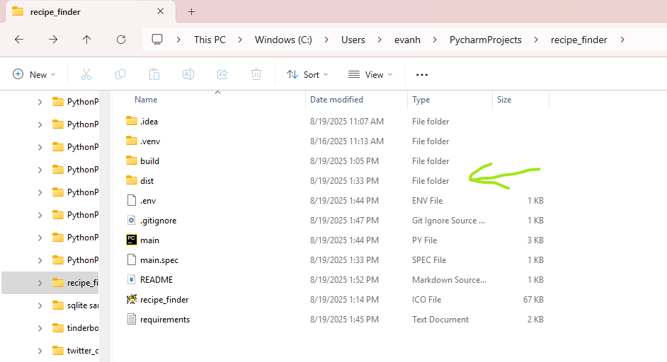

# Recipe Finder

A simple Python Tkinter application that helps you search for recipes based on ingredients.

## Features
- Search for recipes using ingredients
- View recipe details
- Easy-to-use GUI interface
- Built as an executable for Windows

## Installation

1. **Clone the repository:**
   ```bash
   git clone https://github.com/yourusername/recipe_finder.git

2. Navigate to the project directory:

cd recipe_finder


3. (Optional) Create a virtual environment:

python -m venv venv


4. Activate the virtual environment:

Windows:

venv\Scripts\activate


Mac/Linux:

source venv/bin/activate


5. Install dependencies:

pip install -r requirements.txt

**Usage**

Run from Python:

python main.py


Run the executable (Windows):

dist\main.exe



Contributing

Feel free to open issues or submit pull requests if you want to improve the project.

License

This project is licensed under the MIT License.